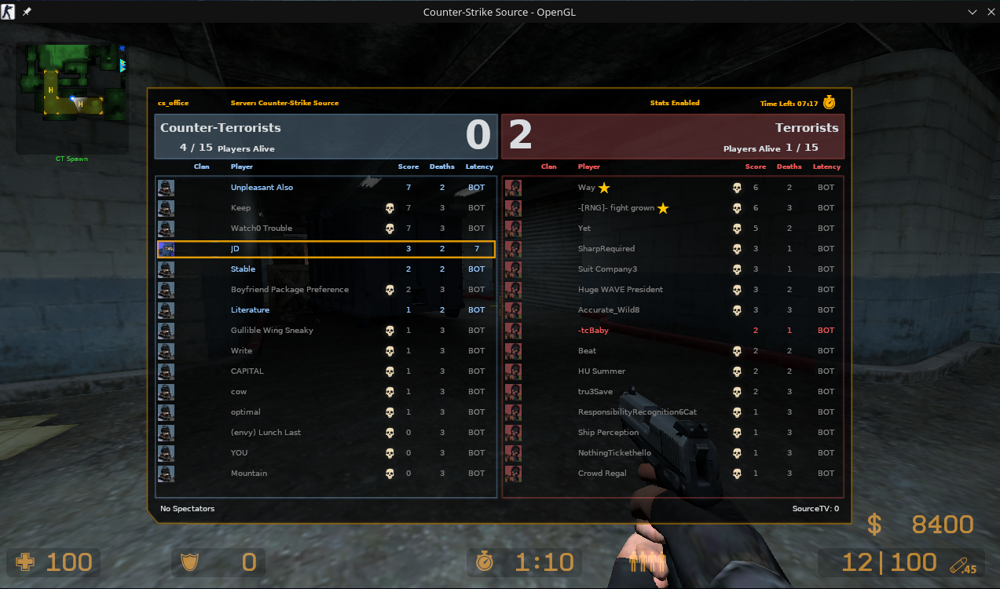

# CS:Source - Bot Profile Generator
*(w/ JSON config + CSV data values)*



## How To Add The Botprofile.db To CS:Source
:TODO:


## Compilation
This assumes that you have `Go` installed on your system as well as `make`.

If you need to install `Go`, check out [The Go Install Guide](https://go.dev/doc/install)

If you need to install `make`, you can use Homebrew or just use your package manager to install it. *(windows, idk)*

### Steps

```bash
cp example.AppConfig.json AppConfig.json
make clean
make build
make run
```


